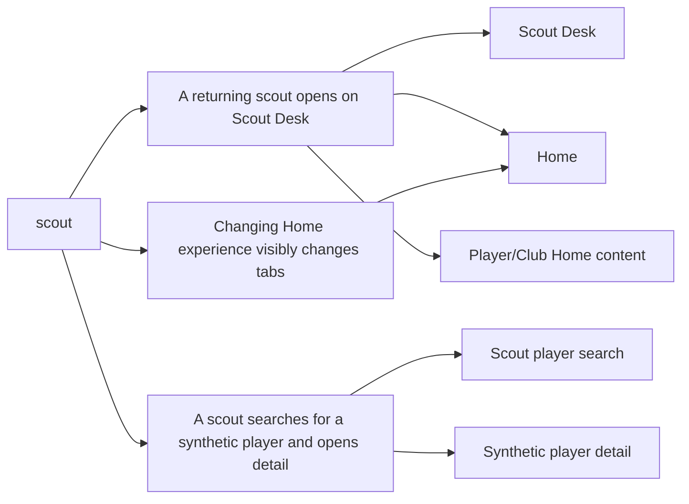
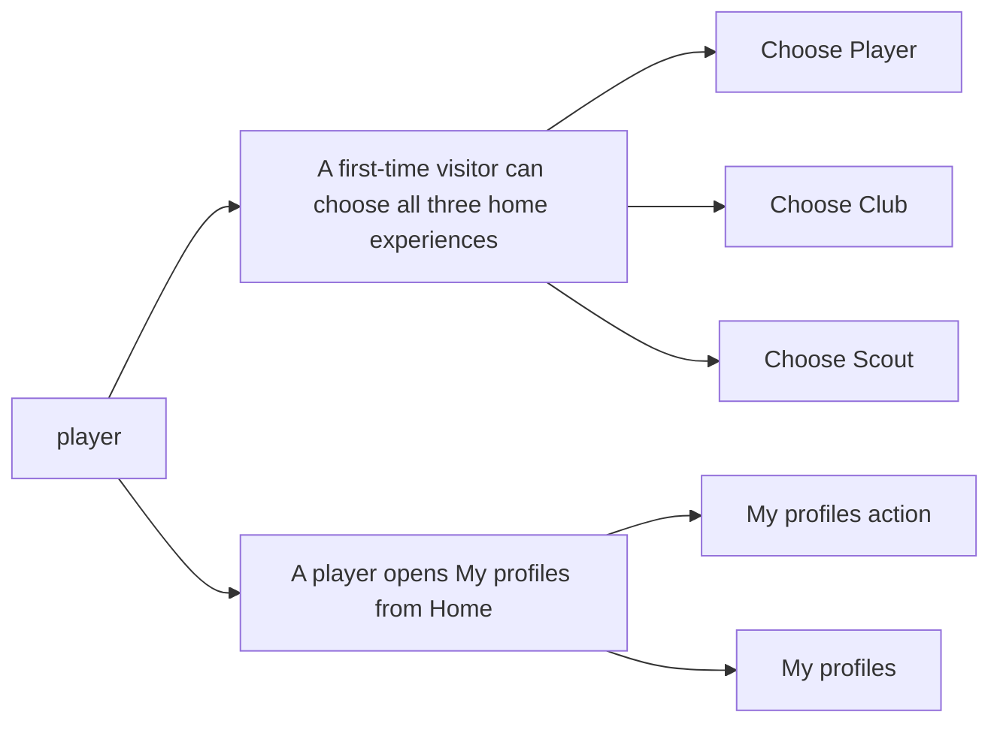
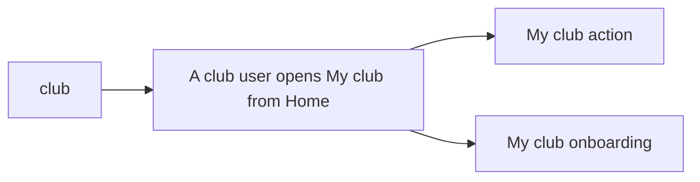

# academy-watch-ios story coverage

Renderer: harness/story-map v1

6 stories; 0 structurally unproven. Runtime proof lives in reports.

## scout

```mermaid
flowchart LR
  classDef unproven stroke-dasharray: 5 5
  n146b7b0253793f2cd50ea32f["scout"]
  n798d060a35dba53a8c335cde["Scout Desk"]
  nc96d5cf53bf0d0dfeb32ff3e["Home"]
  n078dfcb839527d3a44b45781["Scout player search"]
  nbcf95f94224ba94140962121["Synthetic player detail"]
  n84ba303d0e5cd68708b7e769["Player#47;Club Home content"]
  n94cfb1e84bd2610fabbcad73["A returning scout opens on Scout Desk"]
  n146b7b0253793f2cd50ea32f --> n94cfb1e84bd2610fabbcad73
  n94cfb1e84bd2610fabbcad73 --> n798d060a35dba53a8c335cde
  n94cfb1e84bd2610fabbcad73 --> nc96d5cf53bf0d0dfeb32ff3e
  n94cfb1e84bd2610fabbcad73 --> n84ba303d0e5cd68708b7e769
  n523dc9d2c8f6b3292ef7c403["Changing Home experience visibly changes tabs"]
  n146b7b0253793f2cd50ea32f --> n523dc9d2c8f6b3292ef7c403
  n523dc9d2c8f6b3292ef7c403 --> nc96d5cf53bf0d0dfeb32ff3e
  n116deaa81436aece1a5dd821["A scout searches for a synthetic player and opens detail"]
  n146b7b0253793f2cd50ea32f --> n116deaa81436aece1a5dd821
  n116deaa81436aece1a5dd821 --> n078dfcb839527d3a44b45781
  n116deaa81436aece1a5dd821 --> nbcf95f94224ba94140962121
```

## player

```mermaid
flowchart LR
  classDef unproven stroke-dasharray: 5 5
  n93173ac106f2f52b4539450f["player"]
  n164824ed1bd71a974c476a03["Choose Player"]
  n9705359e89d0bf17290a66e0["Choose Club"]
  nde1559c8eb90e698df0987ca["Choose Scout"]
  n81a161d4dd5fa2a75ad5f8ec["My profiles action"]
  n475d1e8001601f1d8010bb94["My profiles"]
  n547f6eaf68515fce633ab161["A first-time visitor can choose all three home experiences"]
  n93173ac106f2f52b4539450f --> n547f6eaf68515fce633ab161
  n547f6eaf68515fce633ab161 --> n164824ed1bd71a974c476a03
  n547f6eaf68515fce633ab161 --> n9705359e89d0bf17290a66e0
  n547f6eaf68515fce633ab161 --> nde1559c8eb90e698df0987ca
  n3e130ecc54435e4d41a772e3["A player opens My profiles from Home"]
  n93173ac106f2f52b4539450f --> n3e130ecc54435e4d41a772e3
  n3e130ecc54435e4d41a772e3 --> n81a161d4dd5fa2a75ad5f8ec
  n3e130ecc54435e4d41a772e3 --> n475d1e8001601f1d8010bb94
```

## club

```mermaid
flowchart LR
  classDef unproven stroke-dasharray: 5 5
  ne07b5aab1c5b3c11b9c1a7ad["club"]
  nd445ea87d0ad5e7dc0312e65["My club action"]
  n00214757f519bff82fbcf6cf["My club onboarding"]
  n231d85ed871df1a7b118b05c["A club user opens My club from Home"]
  ne07b5aab1c5b3c11b9c1a7ad --> n231d85ed871df1a7b118b05c
  n231d85ed871df1a7b118b05c --> nd445ea87d0ad5e7dc0312e65
  n231d85ed871df1a7b118b05c --> n00214757f519bff82fbcf6cf
```
